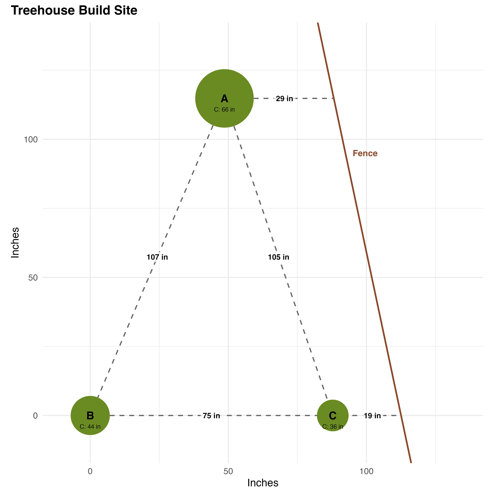

# treehouse-plan (WIP)

A treehouse build plan made in R

## The Site

[1-the-site.qmd](1-the-site.qmd) 

## The Base (so far...)

[2-the-base.qmd](2-the-base.qmd) 

## Notes

This project uses [`renv`](https://rstudio.github.io/renv/) for environment management.

To set up:

``` r
# Install renv if needed
install.packages("renv")

# Restore the exact environment
renv::restore()

# Re-save when you add packages
renv::snapshot()
```
